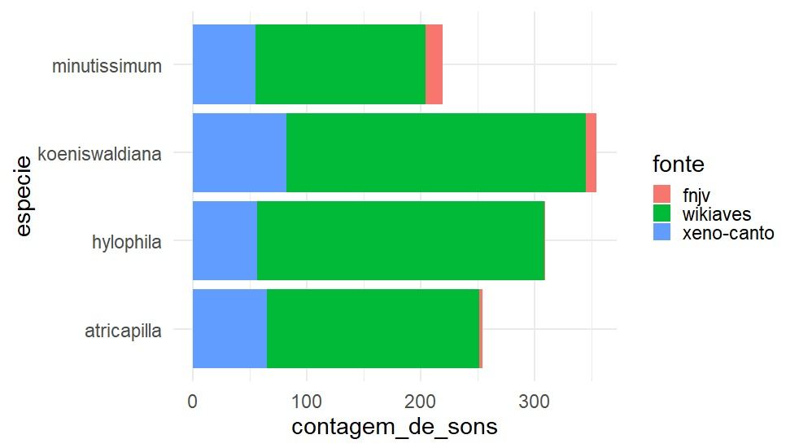

<!-- README.md is generated from README.Rmd. Please edit that file -->

# mestrado

Projeto de pesquisa *“Detectores acústicos automáticos de espécies de
aves noturnas em seu bioma natural”* do Departamento de Engenharia
Mecânica da Escola Politécnica (Laboratório de Acústica e Meio
Ambiente).

Orientador: Prof. Dr. Linilson Padovese

Co-orientador: Dr. Paulo Hubert

## Termos para pesquisar sobre

  - HMM: Hidden Markov Chains
  - MFCC: Mel Frequency Cepstral Coefficients
  - LPC: Linear Predictive Coding
  - LPCC: Linear Prediction Cepstral Coefficients
  - PLP: Perceptual Linear Predictive

## Dados

Em construção.

## Referências

### Fontes de dados

  - <https://www.xeno-canto.org/> **X**

  - <https://www.wikiaves.com.br> **X**

  - <https://www2.ib.unicamp.br/fnjv/>
    **X**

  - <https://www.imageclef.org/lifeclef/2016/bird>

  - <http://sabiod.univ-tln.fr/nips4b/challenge1.html>

  - <https://www.kaggle.com/c/mlsp-2013-birds>

### Artigos de bioacústica

  - <https://lis-unicamp.github.io/wp-content/uploads/2017/07/LeandroTacioli-Mestrado.pdf>
    (Acesso em
    2019-04-14)

  - <file:///C:/Users/ap_da/OneDrive/Documents/mestrado/ignorar/automated%20birdsong%20review.pdf>
    (Acesso em
    2019-05-27)

### Algoritmos de identificação de músicas

  - <https://www.toptal.com/algorithms/shazam-it-music-processing-fingerprinting-and-recognition>

  - <https://royvanrijn.com/blog/2010/06/creating-shazam-in-java/>

  - <https://laplacian.wordpress.com/2009/01/10/how-shazam-works/>

  - <https://github.com/unixjazz/free_shazam>

### Machine Learning

  - <https://towardsdatascience.com/recognizing-speech-commands-using-recurrent-neural-networks-with-attention-c2b2ba17c837>
    (Acesso em 2019-04-14)

  - <https://github.com/douglas125/SpeechCmdRecognition> (Acesso em
    2019-04-14)

  - <https://journals.plos.org/plosone/article?id=10.1371/journal.pone.0179403>
    (Acesso em 2019-04-14)

  - <http://www.naturalhistory.com.br/wasis.html> (Acesso em 2019-04-14)

## Notas

> “There is the need for shared datasets with annotations of a wide
> variety of calls for a large number of species if methods that are
> suitable for conservation work are to be developed.” — Automated
> birdsong recognition in complex acoustic environments: a review

<!--chapter:end:README.Rmd-->
