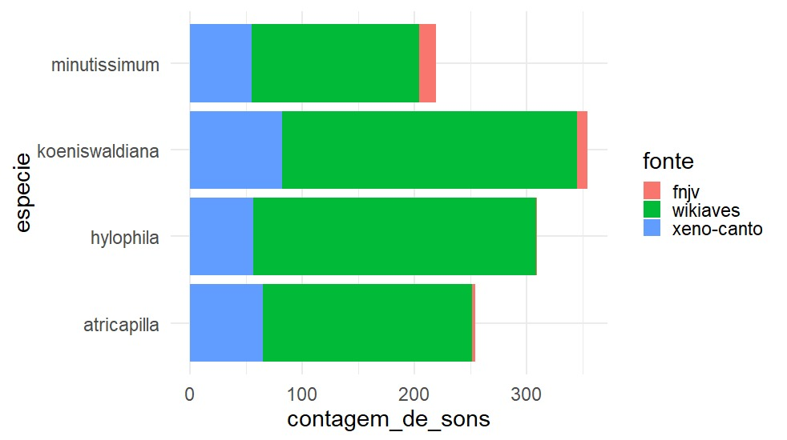

# The Data


```{r, echo=FALSE, message=FALSE, warning=FALSE, error=FALSE}
library(readr)
library(dplyr)
library(ggplot2)
library(forcats)
```


## Resumo das fontes de dados


- [Xeno-Canto](https://www.xeno-canto.org/) 

- [Wikiaves](https://www.wikiaves.com.br)

- [FNJV](https://www2.ib.unicamp.br/fnjv/) 





## Espécies


## Coleta dos Dados

### Xeno-Canto

```{r}

```

### Wikiaves

```{r}

```

### FNJV

```{r}

```


## Anotações dos Cantos (Variável Resposta)

### Identificação das sílabas

### Rotulações


## Pré-processamento

### Redução de Resolução

```{r}

```


### Redução de Ruído

### Normalização

### Spectrograma

### Filtro Passa-banda

### Fatiamento


## Extração de Atributos
