```{r setup, include=FALSE}
options(htmltools.dir.version = FALSE)
knitr::opts_chunk$set(echo = TRUE)
library(patchwork) #devtools::install_github("thomasp85/patchwork")
library(tidyverse)
theme_set(theme_minimal(12))
```

## Sobre mim e meu trabalho

.pull-left[

Athos Damiani, 31, Estatístico pela USP.
<hr/>
Tema do mestrado:

<div align="center">
<strong style = "color: red">Reconhecimento automático de espécies de aves baseados em seus cantos</strong>
</div>

.small[
- Abordagem: Aprendizagem de máquina supervisionada

- **Orientator:** Prof. Dr. Linilson Padovese

- **Co-orientator:** Prof. Dr. Paulo Hubert Jr
]
]

.pull-right[

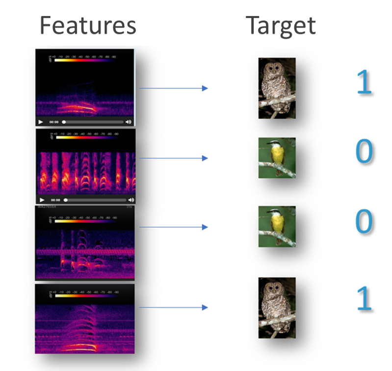

]

---

# Referências

- Padovese B., Padovese L. (2019) **Machine Learning for Identifying an Endangered Brazilian Psittacidae Species**

- Priyadarshani N. et al. (2017) **Automated birdsong recognition in complex acoustic environments: a review**

- Serra, O. et al. (2019) **Active contour-based detection of estuarine dolphin whistles in spectrogram images**

- Jawaherlalnehru, J. et al. (2019) **Music Instrument Recognition from Spectrogram Images Using Convolution Neural Network**
---

# Objetivos

1) Desenvolver e comparar metodologias de modelagem preditiva e de pré-processamento.

2) Disponibilizar bases de dados de sons de pássaros anotadas, prontas para aplicação de aprendizagem de máquina.

3) Disponibilizar ferramentas livres e de código aberto para facilitar tanto a reprodutibilidade das metodologias propostas em (1) quanto para facilitar o embarque dos algoritmos em aparelhos acústicos.

> “There is the need for shared datasets with annotations of a wide variety of calls for a large number of species if methods that are suitable for conservation work are to be developed.” — Automated birdsong recognition in complex acoustic environments: a review

---

## library(wavesurfer)

Ferramenta de anotação de áudio

```{r, eval=FALSE}
# shiny UI

wavesurfer(
  "wavs_folder/wav_file.wav", # or .mp3
  visualization = 'spectrogram' #<<
) %>%
  ws_annotator(labels = c("birdsong", "silence", "insect")) %>% 
  ws_minimap() %>%
  ws_cursor()
```

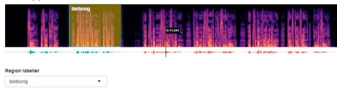

---

## annotator_app()

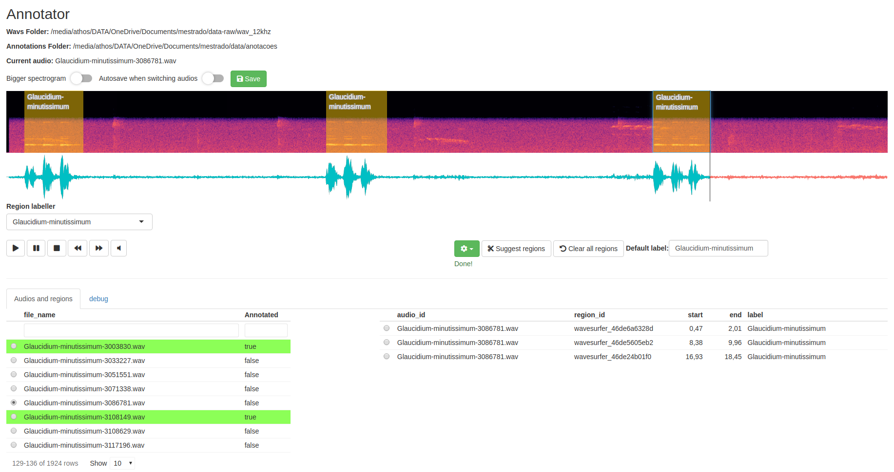


---

## annotator_app()

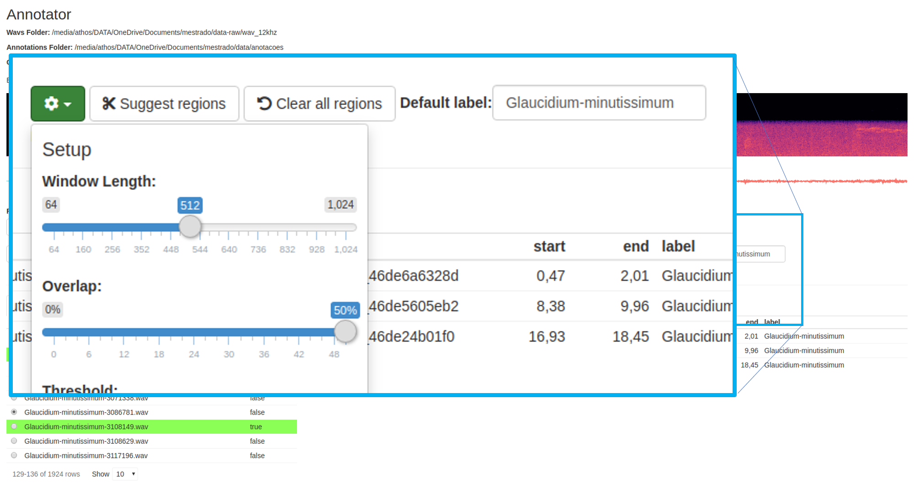

Feito por enquanto com `warbleR::auto_detec()`

---

## annotator_app()

Uma vantagem a ser explorada: pode ser colocado em um aplicativo web em que todos podem contribuir com anotações.


[`r shiny::icon("github")` `Athospd/wavesurfer`](http://github.com/Athospd/wavesurfer)

---

# Dados - Treino/Teste

## Xeno-canto 

Uso do pacote {warbleR} do Marcelo Araya-Salas (2010)

```{r, eval = FALSE}
metadata_xc = map(bird_species, ~querxc(.x))
```

## Wikiaves

Uso do pacote {wikiaves} do LACMAM (2019)

```{r, eval = FALSE}
metadata_wa = map(bird_species, ~querwa(.x))
```


---

# Dados - Treino/Teste

Arquivos .mp3 baixados.

```{r mp3-counts, echo= FALSE, message = FALSE, warning=FALSE}
library(magrittr)

tibble::tibble(Species = list.files("../../data-raw/wav_16khz/") %>%
             stringr::str_remove_all("[.0-9]|(wav)") %>%
             stringr::str_remove_all("-$")
) %>%
  dplyr::count(Species, name = "#mp3", sort = TRUE) %>%
  janitor::adorn_totals() %>%
  knitr::kable(caption = "MP3 files downloaded.", format = "markdown") %>%
  kableExtra::kable_styling(font_size = 16) %>%
  kableExtra::row_spec(6, bold = TRUE)
```


---

# Reprodutibilidade

- {wavesurfer}, {wikiaves} e {mestrado}


```{r, echo = FALSE, fig.retina=3, out.width = 630}
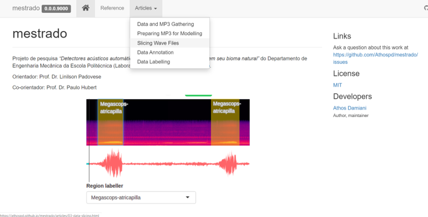
```


---

# Dados para aplicação

Duas paisagens acústicas levantadas pelo LACMAM (Laboratório de Acústica e Meio Ambiente):

- INB-Rezende: 8 meses de duração em 4 pontos. Banda = 12kHz. Tamanho = 8TB.

- Morro Grande: 12 meses de duração em 3 pontos. Banda = 12kHz. Tamanho = 7TB.

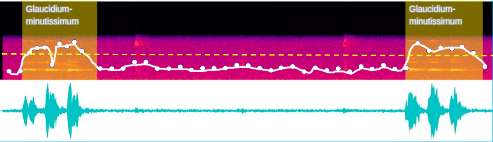

---

# Pré-processamento dos dados

Cada MP3 baixado do Wikiaves e do Xeno-Canto sofreu as seguintes transformações:

1) Conversão de MP3 para WAV;

2) Stereo para Mono;

3) Downsample para 12kHz;

4) Normalização da amplitude para 16-bits (inteiros em [-32767, 32767]);

5) Fatiados em pedaços disjuntos de X em X segundos.

OBS: tentar depender de o mínimo possível de pré-processamento.

---

# Metodologias de Modelagem Preditiva

## Tratamentos acústicos

- Espectrograma

- MFCC

## Algoritmos

- Redes Neurais "Padrão" (Multi Layer Perseptrons)

- Redes Neurais Convolucionais

- Gradient Boosting Machines

- Hidden Markov Models


---

# Metodologias de Modelagem Preditiva

.pull-left[

### Espectrograma

```{r, echo = FALSE, fig.retina=3, out.width = 430}
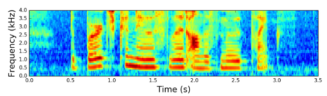
```


### MFCC

```{r, echo = FALSE, fig.retina=3, out.width = 430}
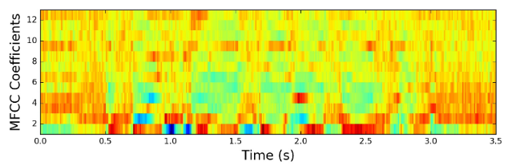
```

]

.pull-right[

<br> 
**passo 1)** transforma...

<br> 
$$
mel = 2595 \log_{10}(1 + \frac{f}{700})
$$

<br> 
**passo 2)** tira uma média ponderada por faixa...

<br> 
```{r, echo = FALSE, fig.retina=3, out.width = 430}
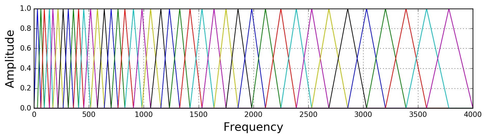
```

]

Fonte: [haythamfayek.com](https://haythamfayek.com/2016/04/21/speech-processing-for-machine-learning.html)


---

# Metodologias de Modelagem Preditiva

## Redes Neurais Convolucionais (CNN's)

- É uma arquitetura de redes neurais que é útil principalmente para classificação de imagens. 

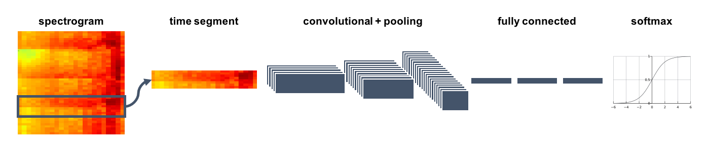


.footnote[
fonte: http://tommymullaney.com/projects/rhythm-games-neural-networks
]

---

# Metodologias de Modelagem Preditiva

## Redes Neurais Convolucionais (CNN's)


.pull-left[

### filtros fixos

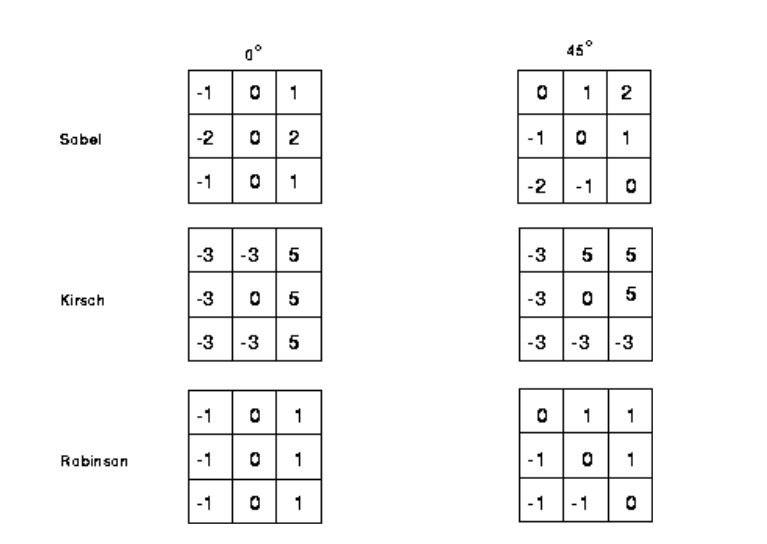

]

.pull-right[

### filtros "aprendidos"

```{r, echo = FALSE, fig.retina=3, out.width = 300}
knitr::include_graphics("img/cnn_wider.png")
```


cada pixel do filtro é como se fosse um beta da regressão.

]

---

# Metodologias de Modelagem Preditiva

## Redes Neurais Convolucionais (CNN's)

.pull-left[
- Definimos uma matriz de pesos (a "sombra" na representação ao lado)

- Andamos com essa matriz de pesos para cada parte da imagem (em azul ao lado). 

- Esses pesos são multiplicados e depois somados para gerar uma nova 'imagem' (em verde).

]

.pull-right[


]

Fonte: [Conv arithmetic](https://github.com/vdumoulin/conv_arithmetic)
---

# Metodologias de Modelagem Preditiva

## Gradient Boosting Machines

```{r, echo = FALSE, fig.retina=3, out.width = 430}
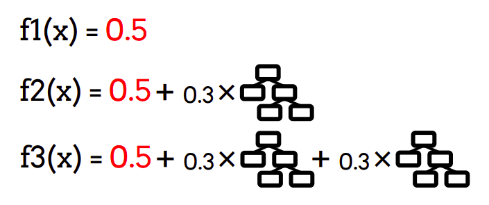
```

Em que x representa todos os pixels dentro de uma fatia de áudio: 
- fatia de 1 segundo 
- janela FFT de 512 amostras e amostragem de 16kHz sem overlap
- 13 MFCC's

Total de pixels: $13 \times 1 \times (16000 / 512) \approx 406$

---

# Alguns resultados...

.pull-left[

### MFCC + XGBoost

```{r, echo = FALSE}
modelo01_obs_vs_pred <- readRDS("../../data_/modelos_mfcc/modelo01_obs_vs_pred.rds")
acc <- modelo01_obs_vs_pred %>% group_by(base) %>% yardstick::accuracy(.pred_class, y)
cm <- modelo01_obs_vs_pred %>% group_by(base) %>% yardstick::conf_mat(.pred_class, y)
cm$conf_mat[[2]] 
```

Acurácia: `r scales::percent(acc$.estimate[2])`

]

.pull-right[

### Espectrograma + CNN

```{r, echo = FALSE}
modelo03_obs_vs_pred <- readRDS("../../data_/modelos_mfcc/modelo03_obs_vs_pred.rds")
acc <- modelo03_obs_vs_pred %>% group_by(base) %>% yardstick::accuracy(.pred_class, y)
cm <- modelo03_obs_vs_pred %>% group_by(base) %>% yardstick::conf_mat(.pred_class, y)
cm$conf_mat[[2]] 
```

Acurácia: `r scales::percent(acc$.estimate[2])`

]

---

# Metodologias de Modelagem Preditiva

Demais parâmetros para testar:

1) Tamanho da fatia do áudio.

2) Parametrizações do FFT.

2) Uso de dois algoritmos ou mais ao mesmo tempo (stacking).

3) Arquiteturas de Redes Neurais.

---

class: inverse, center, middle

# Obrigado!
