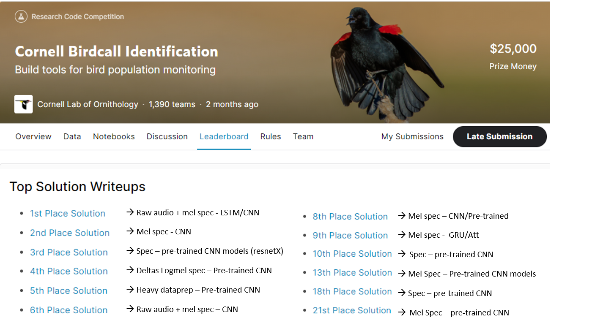

```{r setup, include=FALSE}
options(htmltools.dir.version = FALSE)
knitr::opts_chunk$set(echo = TRUE)
library(patchwork) #devtools::install_github("thomasp85/patchwork")
library(tidyverse)
theme_set(theme_minimal(12))
```

# About me

.pull-left[

Athos Damiani, 32, Statistician from IME-USP, Brazil.

Master Student at Poli-USP, Brazil.

<hr/>
Project topic:

<div align="center">
<strong style = "color: red">Automated Bird Species Recognition Based on Their Songs</strong>
</div>

.small[

- **Advisor:** PhD. Linilson Padovese

- **Co-advisor:** PhD. Paulo Hubert Jr

- Approach: Supervised Machine Learning

]
]

.pull-right[


]

---

# About LACMAM


```{r, echo = FALSE, fig.retina=3, out.width = 850}

```


---

# Objectives

1) Literature review of methodologies used in bird species regocgnition tasks.

2) Build an automatic detector (classifier) for 5 brazilian bird species.

3) Scan a 5TB sized soundscape to try to spot those 5 bird species in it.

# Agenda for this presentation

1) My findings and perception about my literature review

2) Some early experiments and partial results

---

# Conclusions from literature review

### 1) Deep learning methods are proving to be the best approach for bird species recognition tasks.

### 2) Annotated dataset needed.


---

# Methodologies

.pull-left[

```{r, echo = FALSE, fig.retina=3, out.width = 850}

```

Setups:

- Wavelet Denoising
- Crops/Filters
- Data augmentation
- Resampling


]

.pull-right[

Data Representations

- Raw amplitudes
- Spectrogram
- Mel Spec
- MFCC
- DWT
- Morphological
- SIFS

Methods

- HMM
- GMM
- Random Forest
- Deep Learning
- SVM

]

---

# Evidences of deep learning success

```{r, echo = FALSE, fig.retina=3, out.width = 850}

```

All of the top solutions used `PyTorch` for fiting the models

---

# Evidences of deep learning success

**Other audio competitions:**
 
 (ongoing)
 
```{r, echo = FALSE, fig.retina=3, out.width = 450}

```

- [Freesound Audio Tagging](https://www.kaggle.com/c/freesound-audio-tagging-2019) - CNNs
- [Bird Challange](https://www.kaggle.com/c/the-icml-2013-bird-challenge) - CNNs
- [Whale Detection](https://www.kaggle.com/c/whale-detection-challenge) - template matching approach
- [DCase - Bird Detection](http://dcase.community/challenge2018/task-bird-audio-detection) - CNNs (Lasseck, 2018)

.footnote[
[Lasseck, Mario. 2018. ACOUSTIC BIRD DETECTION WITH DEEP CONVOLUTIONAL NEURAL NETWORKS. Berlin.](http://dcase.community/documents/challenge2018/technical_reports/DCASE2018_Lasseck_76.pdf)
]


---

# Partial Results...

.pull-left[

#### MFCC + LightGBM

```r
##           Truth
## Prediction    1    2    3
##          1 4057    4  172
##          2  187  358    1
##          3  361    1  322
```

Accuracy: 87%


#### MelSp+ResNet18 (Keydana, 2020)

```r
##           Truth
## Prediction    1    2    3
##          1 4049   20  164
##          2   79  443    0
##          3  222    1  461
```

Accuracy: 91%


]

.pull-right[

#### Raw Audio + 1D CNN (Abdoli, 2019)

```r
##           Truth
## Prediction    1    2    3
##          1 4010   24  199
##          2  102  443    1
##          3  248    3  433
```

Accuracy: 89%


#### Ideas from other papers

1) Duration of audio slices and FFT size

2) Usage of two or more algoritms ensembled (stacking)

3) Rectangular Kernels

]

---

# Discussion/Opinion

**Pros of Deep Learning**

- Automatic feature engineering and powerful performance (even when dealing with noisy audios).

- Modular, easy to share, reuse and reproduce.

- Tools shuch as [PyTorch](https://pytorch.org/) are free and "research-and-production-first".

- Designed to be fast (optimized for GPUs).

**Cons of Deep Learning**

- It is not a trivial field to initiate.

- Requires at least basic programming background.

- **Requires large amount of data!**


---

# Hand crafted vs Automatic Feature Engineering: An Illustration

```{r, echo = FALSE, fig.retina=3, out.width = 650}

```

---

# Annotated dataset needed

Absence of labelled datasets is the "bottle neck".

>  "It is important that benchmark datasets are available, so that different researchers can compare their methods on the same datasets, and using the same metrics."

<br/>

> “There is the need for shared datasets with annotations of a wide variety of calls for a large number of species if methods that are suitable for conservation work are to be developed.” 

<br/>

**— Automated birdsong recognition in complex acoustic environments: a review (Nirosha Priyadarshani, Stephen Marsland and Isabel Castro, 2017)**


---

# Datasets "Culture" in Machine Learning

.pull-left[


```{r, echo = FALSE, fig.retina=3, out.width = 330}

```

Source: Pytorch.org

]

.pull-rigth[


```{r, echo = FALSE, fig.retina=3, out.width = 370}

```

<br/>

```{r, echo = FALSE, fig.retina=3, out.width = 370}

```

]

---

# Datasets "Culture" in Machine Learning

.pull-left[

Sources of brazilian bird calls that are not "machine-learning-ready" yet:

- Xeno-canto.org
- Wikiaves.com.br 

Datasets of bird sounds from Kaggle are "Machine-learning-ready", but lacks of brazilian representants.

Solution is to build our own.

]

.pull-right[


```{r, echo = FALSE, fig.retina=3, out.width = 250}
knitr::include_graphics("img/birdcallbr.png")
```

**Not published yet**

]


---

# Data Gathering

## Xeno-canto 

{warbleR} R package by Marcelo Araya-Salas (2010)

```{r, eval = FALSE}
metadata_xc = map(bird_species, ~querxc(.x))
```

## Wikiaves

{wikiaves} R package from LACMAM (2019)

```{r, eval = FALSE}
metadata_wa = map(bird_species, ~querwa(.x))
```


---

# Data Gathering

.mp3 files downloaded.

```{r mp3-counts, echo= FALSE, message = FALSE, warning=FALSE}
library(magrittr)

tibble::tibble(Species = list.files("../../data-raw/wav_16khz/") %>%
             stringr::str_remove_all("[.0-9]|(wav)") %>%
             stringr::str_remove_all("-$")
) %>%
  dplyr::count(Species, name = "#mp3", sort = TRUE) %>%
  janitor::adorn_totals() %>%
  knitr::kable(caption = "MP3 files downloaded.", format = "markdown") %>%
  kableExtra::kable_styling(font_size = 16) %>%
  kableExtra::row_spec(6, bold = TRUE)
```


---

# Side products

.pull-left[

Step-by-step tutorials with code for reproducibility

```{r, echo = FALSE, fig.retina=3, out.width = 330}

```

[https://athospd.github.io/mestrado/](https://athospd.github.io/mestrado/)

]

.pull-right[
R packages created: 

- `{wikiaves}` - mp3 download
- `{wavesurfer}` - annotation
- `{torchaudio}` - modeling
- `{mestrado}` - reproducibility

]


---

# References

- Padovese B., Padovese L. (2019) **Machine Learning for Identifying an Endangered Brazilian Psittacidae Species**

- Priyadarshani N. et al. (2017) **Automated birdsong recognition in complex acoustic environments: a review**

- Serra, O. et al. (2019) **Active contour-based detection of estuarine dolphin whistles in spectrogram images**

- Jawaherlalnehru, J. et al. (2019) **Music Instrument Recognition from Spectrogram Images Using Convolution Neural Network**

- Keydana, S. (2020) **Classifying images with torch**

- Sajjad, A et al. (2019) **End-to-End Environmental Sound Classification using a 1D Convolutional Neural Network**

---

class: inverse, center, middle

# Thank you!


---

## library(wavesurfer)

Tool for audio annotation in R [`r shiny::icon("github")` `Athospd/wavesurfer`](http://github.com/Athospd/wavesurfer)

```{r, eval=FALSE}
# shiny UI

wavesurfer(
  "wavs_folder/wav_file.wav", # or .mp3
  visualization = 'spectrogram' #<<
) %>%
  ws_annotator(labels = c("birdsong", "silence", "insect")) %>% 
  ws_minimap() %>%
  ws_cursor()
```


---

## library(wavesurfer)

Tool for audio annotation in R [`r shiny::icon("github")` `Athospd/wavesurfer`](http://github.com/Athospd/wavesurfer)


---

# Predictive Modeling Methodologies

.pull-left[

### Spectrogram

```{r, echo = FALSE, fig.retina=3, out.width = 430}
knitr::include_graphics("img/Espectrograma.jpg")
```


### MFCC

```{r, echo = FALSE, fig.retina=3, out.width = 430}
knitr::include_graphics("img/mfcc.jpg")
```

]

.pull-right[

<br> 
**passo 1)** transform...

<br> 
$$
mel = 2595 \log_{10}(1 + \frac{f}{700})
$$

<br> 
**passo 2)** weighted mean by frequency region...

<br> 
```{r, echo = FALSE, fig.retina=3, out.width = 430}

```

]

Fonte: [haythamfayek.com](https://haythamfayek.com/2016/04/21/speech-processing-for-machine-learning.html)


---

# Predictive Modeling Methodologies

## Convolutional Neural Networks (CNN's)


.footnote[
fonte: http://tommymullaney.com/projects/rhythm-games-neural-networks
]


---

# Predictive Modeling Methodologies

## Convolutional Neural Networks (CNN's)

.pull-left[
- Define a matrix of weights (the "shadow" onto animation)

- Scan the image with this matrix (blue matrix). 

- The new 'imagem' (in green) is made by the convolution between the blue matrix and the shadow.

]

.pull-right[


]

Fonte: [Conv arithmetic](https://github.com/vdumoulin/conv_arithmetic)
---

# Predictive Modeling Methodologies

## Gradient Boosting Machines

```{r, echo = FALSE, fig.retina=3, out.width = 430}

```

Where x represents all of the pixels from a MFCC set of an audio sample: 
- 1 second long slices 
- FFT window of 512 samples and sample rate of 16kHz with no overlap
- 13 MFCC's

Total pixels: $13 \times 1 \times (16000 / 512) \approx 406$

---


