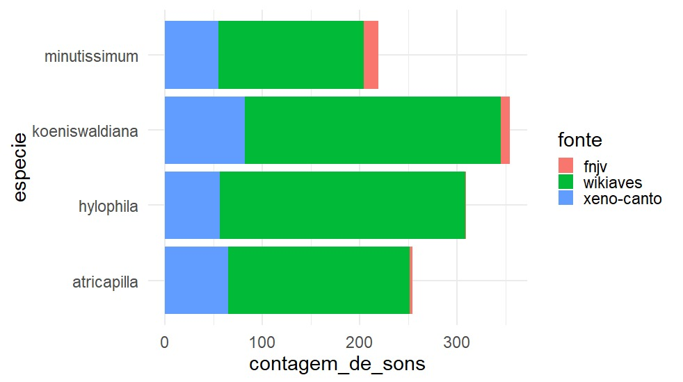

# Bancos de Dados


```{r setup, include=FALSE}
knitr::opts_chunk$set(echo = FALSE)
```

```{r, echo=FALSE, message=FALSE, warning=FALSE, error=FALSE}
library(readr)
library(dplyr)
library(ggplot2)
library(forcats)
```


## Resumo das fontes de dados


- [Xeno-Canto](https://www.xeno-canto.org/) 

- [Wikiaves](https://www.wikiaves.com.br)

- [FNJV](https://www2.ib.unicamp.br/fnjv/) 




## Xeno-Canto

## Wikiaves

## FNJV


