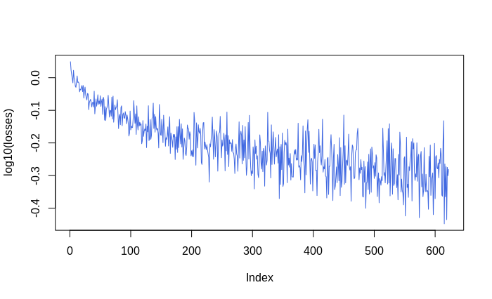

```{r, include = FALSE}
knitr::opts_chunk$set(
  collapse = TRUE,
  comment = "#>",
  warning = FALSE,
  message = FALSE
)
```

## Reference

- [Abdoli, S., Cardinal, P., Koerich, A L (2019). End-to-End Environmental Sound Classification using a 1D Convolutional Neural Network.](http://arxiv.org/abs/1904.08990)

- [Keydana (2020, Oct. 19). RStudio AI Blog: Classifying images with torch.](https://blogs.rstudio.com/tensorflow/posts/2020-10-19-torch-image-classification/)


```{r setup, eval=TRUE}
library(mestrado)
library(torch)
library(torchaudio)
library(purrr)
```

## BirdcallBR {torch} Dataset

The function `birdcallbr_dataset()` is a [torch::dataset()] ready to be used for modeling with {torch} framework. To know more about torch datasets, see [this](https://torch.mlverse.org/docs/articles/examples/dataset.html) and [this](https://torch.mlverse.org/docs/reference/dataset.html). 

One of the options offered by `birdcallbr_dataset()` is the audio duration. If argument `audio_duration = 1` then audio samples will be 1 second long. These takes are slices from a given original wav file with potential several seconds long. The current options allowed are 1, 2 and 5 seconds. This will example will work on the 1 second long wave slices. 

```{r}
bcbr2_train <- birdcallbr_dataset("../data-raw", audio_duration = 1, download = FALSE, train = TRUE)
bcbr2_test <- birdcallbr_dataset("../data-raw", audio_duration = 1, download = FALSE, train = FALSE)

length(bcbr2_train)
length(bcbr2_test)
```

All the files were downsampled to 16kHz, so each one of those `r length(bcbr2_train)` + `r length(bcbr2_test)` 1sec samples will have 16000 samples.

### An Instance Example

Each instance is a named list with the ``r names(bcbr2_train[1])`` entrances

First instance from training set:

```{r}
bcbr2_train[1]
```


The waveform and the mel spectrogram:


```{r, eval = FALSE}
# waveform plot
waveform <- bcbr2_train[1]$waveform$squeeze(1)
plot(as.numeric(waveform), type = "l", col = "royalblue")

# mel spec plot
melspec <- torchaudio::transform_mel_spectrogram(1024, 1024, 128, n_mels = 128, power = 1)
mestrado::plot_pixel_matrix(
  torch_log10(melspec(waveform)),
  title = paste0("Target bird species: ",  bcbr2_train[1]$label)
)
```


```{r, echo = FALSE, message=FALSE, warning=FALSE}
knitr::include_graphics(c("../inst/img/waveform_1dconv.png", "../inst/img/melspec_1dconv.png"))
```


## Device Setup

A conveninent code conditioning the device according with the current machine running this code. If `cuda` is available, then it will be set to be the main device.

```{r}
device <- torch_device(if (cuda_is_available()) "cuda" else "cpu")

if(device$type == "cuda") {
  num_workers <- 1
  pin_memory <- TRUE
} else {
  num_workers <- 0
  pin_memory <- FALSE
}
```


## The Batch

As (probably) the dataset is too big to fit in memory, do things in batches is needed. The `collate_fn(batch)` function has the task to stack up a list of samples into a big tensor. It will be feeded to a dataloader, which will know how and when fetch a new batch of fresh data.

```{r}
# Make all tensor in a batch the same length by padding with zeros
pad_sequence <- function(batch) {
  batch <- sapply(batch, function(x) (x$t()))
  batch <- torch::nn_utils_rnn_pad_sequence(batch, batch_first = TRUE, padding_value = 0.)
  return(batch$permute(c(1, 3, 2)))
}

# Group the list of tensors into a batched tensor
collate_fn <- function(batch) {
  # A batch list has the form:
  # list of lists: (waveform, slice_id, filepath, sample_rate, label, label_one_hot)
  # Transpose it
  batch <- purrr::transpose(batch)
  tensors <- batch$waveform
  targets <- batch$label_index
  
  tensors <- pad_sequence(tensors)$to(device = device)
  targets <- torch::torch_tensor(unlist(targets))$to(device = device)
  
  return(list(tensors = tensors, targets = targets))
}
```

```{r}
batch_size <- 64

## dataloader for train set
bcbr2_train_dl <- dataloader(
  dataset = bcbr2_train, batch_size = batch_size, 
  shuffle = TRUE, collate_fn = collate_fn,
  num_workers = num_workers, pin_memory = pin_memory
)

## dataloader for test set
bcbr2_test_dl <- dataloader(
  dataset = bcbr2_test, batch_size = batch_size, 
  shuffle = FALSE, collate_fn = collate_fn,
  num_workers = num_workers, pin_memory = pin_memory
)
```

## The Model

This model is inspired by archtecture presented in [(Abdoli, 2019)](http://arxiv.org/abs/1904.08990). Here is called as `Raw1DNet`.

```{r}
Raw1DNet <- nn_module(
  "Raw1DNet",
  initialize = function() {
    self$conv1 <- nn_conv1d( 1,  16, kernel_size = 64, stride = 2) # (1, 16000) --> (16, 7969)
    self$bn1   <- nn_batch_norm1d(16) 
    self$pool1 <- nn_avg_pool1d(8) # (16, 996)
    self$conv2 <- nn_conv1d(16,  32, kernel_size = 32, stride = 2) # (16, 1996) --> (32, 483)
    self$bn2   <- nn_batch_norm1d(32)
    self$pool2 <- nn_avg_pool1d(8) # (32, 60)
    self$conv3 <- nn_conv1d(32,  64, kernel_size = 16, stride = 2) # (32, 123) --> (64, 23)
    self$bn3   <- nn_batch_norm1d(64)
    self$pool3 <- nn_avg_pool1d(2) # (64, 11)
    self$conv4 <- nn_conv1d(64, 128, kernel_size =  2, stride = 1) # (64, 11) --> (128, 10)
    self$bn4   <- nn_batch_norm1d(128)
    self$pool4 <- nn_avg_pool1d(10)
    self$lin1 <- nn_linear(128, 64)
    self$bn5   <- nn_batch_norm1d(64)
    self$lin2 <- nn_linear(64, 10)
    self$bn6   <- nn_batch_norm1d(10)
    self$lin3 <- nn_linear(10, 3)
    self$softmax <- nn_log_softmax(2)
  },
  
  forward = function(x) {
    out <- x %>%
      self$conv1() %>%
      nnf_relu() %>%
      self$bn1() %>%
      self$pool1() %>%
      self$conv2() %>%
      nnf_relu() %>%
      self$bn2() %>% 
      self$pool2() %>%
      self$conv3() %>%
      nnf_relu() %>%
      self$bn3() %>%
      self$pool3() %>%
      self$conv4() %>%
      nnf_relu() %>%
      self$bn4() 
    
    out <- self$pool4(out)$squeeze(3) %>% 
      self$lin1() %>%
      self$bn5() %>%
      nnf_relu() %>%
      self$lin2() %>%
      self$bn6() %>%
      nnf_relu() %>%
      self$lin3() %>%
      self$softmax()
    
    return(out)
  }
)
```

Instantiating...

```{r}
model <- Raw1DNet()
model$to(device = device)
# model(bcbr2_train_dl$.iter()$.next()$tensors)

str(model$parameters)

count_parameters <- function(model) {
  requires <- purrr::map_lgl(model$parameters, ~.$requires_grad)
  params <- purrr::map_int(model$parameters[requires], ~.$numel())
  sum(params)
}
count_parameters(model)
```

## Loss, Optmizer and Scheduler

```{r}
criterion <- nn_nll_loss()
optimizer <- torch::optim_sgd(model$parameters, lr = 0.005, weight_decay = 0.00001)
scheduler <- torch::lr_step(optimizer, step_size = 10, gamma = 0.1) 
```

## Train and Test Loops

Train loop:

```{r}
train <- function(model, epoch, log_interval) {
  model$train()
  
  batches <- enumerate(bcbr2_train_dl)
  for(batch_idx in seq_along(batches)) {
    batch <- batches[batch_idx][[1]]
    data <- batch[[1]]$to(device = device)
    target <- batch[[2]]$to(device = device)
    
    output <- model(data)
    loss <- criterion(output, target)$to(device = device)
    
    optimizer$zero_grad()
    loss$backward()
    optimizer$step()
    
    # update progress bar
    pbar$tick(tokens = list(loss = loss$item()))
    
    # record loss
    losses <<- c(losses, loss$item()) 
    if(batch_idx %% log_interval == 0) {
      if(batch_idx != log_interval) dev.off()
      plot(log10(losses), type = "l", col = "royalblue")
    }
  }
}
```


Test loop:

```{r}
# count number of correct predictions
number_of_correct <- function(pred, target) {
  return(pred$squeeze()$eq(target)$sum()$item())
}

# find most likely label index for each element in the batch
get_likely_index <- function(tensor) {
  return(tensor$argmax(dim=-1L) + 1L)
}

test <- function(model, epoch) {
  model$eval()
  correct <- 0
  batches <- enumerate(bcbr2_test_dl)
  obs_vs_pred <- data.frame(obs = integer(0), pred = numeric(0))
  for(batch_idx in seq_along(batches)) {
    batch <- batches[batch_idx][[1]]
    data <- batch[[1]]$to(device = device)
    target <- batch[[2]]$to(device = device)
    
    output <- model(data)
    
    pred <- get_likely_index(output)
    correct <- correct + number_of_correct(pred, target)
    obs_vs_pred <- rbind(
      obs_vs_pred, 
      data.frame(
        obs = as.integer(target$to(device = torch_device("cpu"))), 
        pred = as.numeric(pred$to(device = torch_device("cpu")))
      )
    )
    
    # update progress bar
    pbar$tick()
  }
  print(glue::glue("Test Epoch: {epoch}	Accuracy: {correct}/{length(bcbr2_test_dl$dataset)} ({scales::percent(correct / length(bcbr2_test_dl$dataset))})"))
  print(obs_vs_pred %>% dplyr::mutate_all(as.factor) %>% yardstick::conf_mat(obs, pred))
}
```


## Model Fitting

```{r, eval = FALSE}
log_interval <- 40
n_epoch <- 50

losses <- c()

for(epoch in seq.int(n_epoch)) {
  cat(paste0("Epoch ", epoch, "/", n_epoch, "\n"))
  pbar <- progress::progress_bar$new(total = (length(bcbr2_train_dl) + length(bcbr2_test_dl)), clear = FALSE, width = 90,
                                     incomplete = ".", format = "[:bar] [:current/:total :percent] - ETA: :eta - loss: :loss")
  
  train(model, epoch, log_interval)
  test(model, epoch)
  plot(losses, type = "l", col = "royalblue")
  scheduler$step()
}
```

``` r
#> [================================================] [323/323 100%] - ETA:  0s - loss: :loss
#> Test Epoch: 2	Accuracy: 2713/3316 (82%)
#>           Truth
#> Prediction    1    2    3
#>          1  168   24    2
#>          2  136 2338  403
#>          3    2   36  207
#> Epoch 3/50
#> [==========>.........................] [102/323  32%] - ETA:  1m - loss: 0.534031510353088
#> 
#> (truncated...)
#> 
#> Test Epoch: 50/50
#> Accuracy: 2934/3316 (88%)
#>           Truth
#> Prediction    1    2    3
#>          1  246   39    3
#>          2   60 2286  207
#>          3    0   73  402
```

## Performance

```{r, echo = FALSE, message=FALSE, warning=FALSE, fig.width=8}

cm <- tibble::tribble(
~Prediction,    ~Galu,    ~Unknown,    ~Sp,
          "Galu",   246,    39,     3,
          "Unknown",    60,  2286,   207,
          "Sp",     0,    73,   402
)

kableExtra::kable(cm, align = "lccc", caption = "**Teste accuracy of 88%**") %>% kableExtra::kable_styling(full_width = F, position = "float_left")
```


## Wrap Up

- Input: raw audio.
- Archtecture: combo os 1D convolution layers + relu + batch norm.
- Test acc of 88%, not bad for such simple approach! But can be improved for sure. There are (Mel) Spectrograms, MFCCs and 2D convolutions to be explored.


``` r
# stores ------------------------------------------------------
# torch::torch_save(model, "inst/modelos/raw_1dconv_1seg.pt")

# restore -----------------------------------------------------
# model <- torch::torch_load("inst/modelos/raw_1dconv_1seg.pt")
# model$parameters %>% purrr::walk(function(param) param$requires_grad_(TRUE))
```
